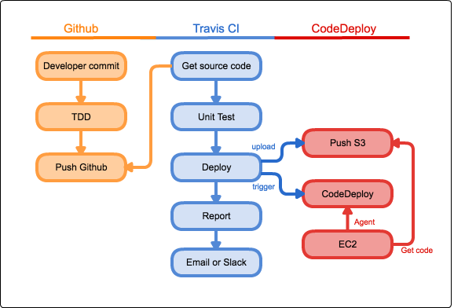
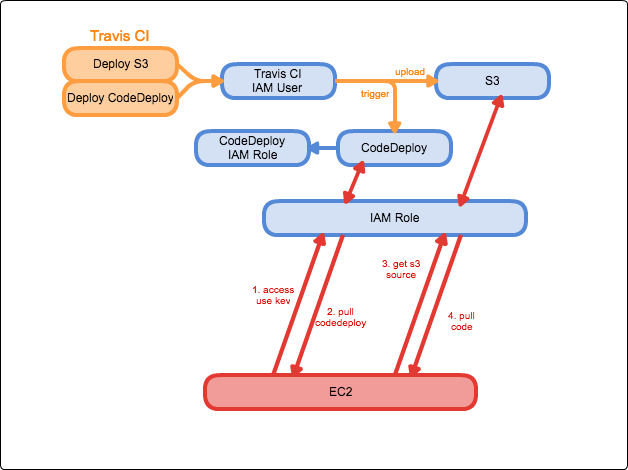
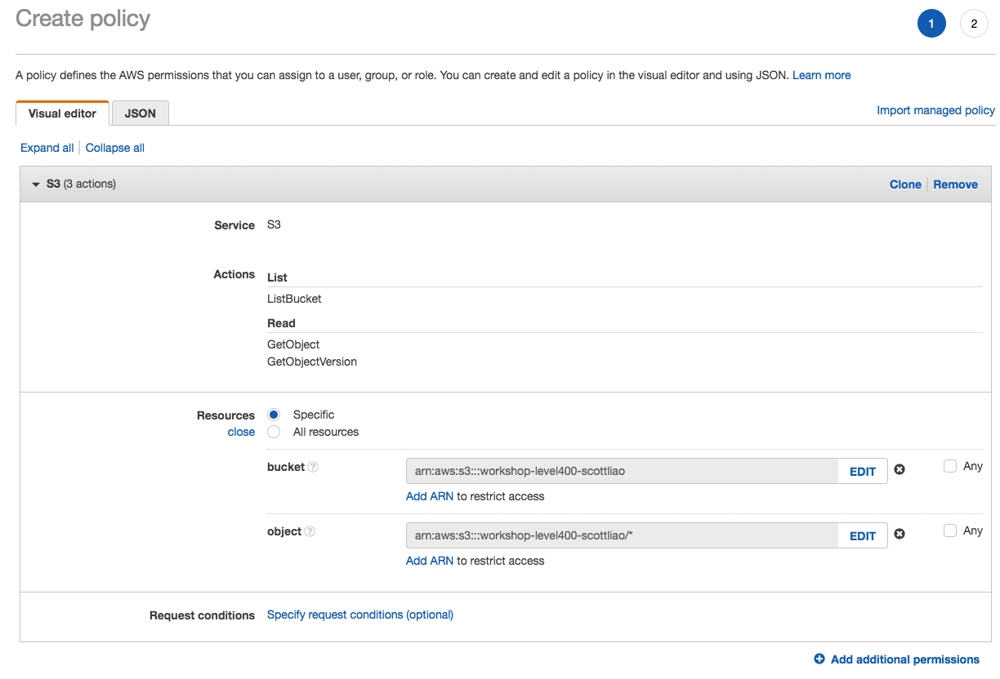

# Level 400 – AWS 上的 CI / CD（Github、Travis CI、CodeDeploy）

## 說明

AWS 的 CI / CD 實作課程（Workshop），需提前準備 Github、AWS 帳號（私人或企業皆可）。

## 目標

### CI / CD Flow 



### Travis CI and AWS Service Component



## 訓練對象

已有 Github、Travis CI、AWS 有基礎概念者（至少需 Level 200）

## LAB Start

### AWS S3 bucket

-  Create S3 bucket `workshop-level400-s3-scottliao` for source code deployment.

    - region `N. Virginia`

### AWS IAM

-  Create IAM Role for EC2

    1.  Create IAM Policy `workshop-level400-ec2-policy-scottliao` to access `S3` for EC2

        - policy
    
            ```json
            {
                "Version": "2012-10-17",
                "Statement": [
                    {
                        "Sid": "Stmt1492113265000",
                        "Effect": "Allow",
                        "Action": [
                            "s3:GetObject",
                            "s3:GetObjectVersion",
                            "s3:ListBucket"
                        ],
                        "Resource": [
                            "arn:aws:s3:::workshop-level400-s3-scottliao",
                            "arn:aws:s3:::workshop-level400-s3-scottliao/*"
                        ]
                    }
                ]
            }
            ```

        

    2. Create IAM Role `workshop-level400-ec2-role-scottliao` for EC2
    
        - select `EC2` type of trusted entity
        - select `workshop-level400-iam-policy-scottliao` policy

- Create IAM User for Travis CI

    1. Create IAM Policy `workshop-level400-travisci-policy-scottliao` to access `S3` for Travis CI

        ```json
        {
            "Version": "2012-10-17",
            "Statement": [
                {
                    "Sid": "Stmt1492113265001",
                    "Effect": "Allow",
                    "Action": [
                        "s3:*"
                    ],
                    "Resource": [
                        "arn:aws:s3:::workshop-level400-s3-scottliao/*"
                    ]
                }
            ]
        }
        ```

- Create IAM User `workshop-level400-travisci-user-scottliao` to access `S3` and `CodeDeploy` for Travis CI
    
    - Access type `Programmatic access`
    - Attach existing polices `AWSCodeDeployDeployerAccess`
    - Click `Next:Review`
    - Click `Create User`
    - Remember click `Download.csv`
    - Add one more policy (we can't add multiple policies at the same time, so please follow the steps below to add another one)
        - `User name` -> `permission` -> `add perssions` -> `Attach existing polices`
        - Choose policy `workshop-level400-travisci-policy-scottliao`
    - Add persiions
    
- Create IAM Role `workshop-level400-codedeploy-scottliao` for CodeDeploy

    - select `CodeDeploy` type of trusted entity
    - Attach policy `AWSCodeDeployRole` 

### AWS EC2

- Create EC2 instance
    
    - machine image `Ubuntu Server 16.04 LTS (HVM), SSD Volume Type`
    - instance type `t3.nano`
    - auto-assign Public IP `enable`
    - IAM role select `workshop-level400-ec2-role-scottliao`
    - write `user-data` for `codedeploy-agent` install and `web content`.
        ```bash
        #!/bin/bash
        # AWS CodeDeploy
        sudo DEBIAN_FRONTEND=noninteractive apt-get -y install ruby
        cd /tmp; wget -O install-codedeploy https://aws-codedeploy-ap-northeast-1.s3.amazonaws.com/latest/install
        chmod 755 install-codedeploy
        sudo ./install-codedeploy auto
        
        # Add web content
        sudo DEBIAN_FRONTEND=noninteractive apt-get -y install apache2
        echo "AWS Level 400 Workshop" > /var/www/html/index.html
        ```
    - Add tags `Key:Name`, `Value:workshop-web`
    - Add new security group
        - Name `workshop-level400-web-sg-scottliao`
        - Rule
            - type `HTTP`, Source `MyIP`
            - type `SSH`, Source `MyIP`
    - Without key pair

### AWS CodeDeploy

- Create CodeDeploy Application for deployment
    - select `custom deployment` (We are top user)
    - deployment type `In-place deployment`
    - Tags of instance `Key:Name`, `Value:workshop-web`
    - Service role `workshop-level400-codedeploy-scottliao`

### Github

- Create repository  for workshop
    - repository name `workshop-aws-cicd`

      - [x] initialize this repository with a README

    - Add /version.html
        ```html
        Demo Verson 1.0 by CI / CD.
        ```
    - Add /.travis.yml
        ```yaml
        language: bash
        before_deploy:
          - zip -r latest *
          - test -d dpl_cd_upload || mkdir dpl_cd_upload
          - mv latest.zip dpl_cd_upload/workshop-${TRAVIS_BUILD_NUMBER}.zip
        deploy:
        - provider: s3
          access_key_id: $AWS_ACCESS_KEY
          secret_access_key: 
            secure: $AWS_SECRET_ACCESS_KEY
          local_dir: dpl_cd_upload
          skip_cleanup: true
          region: us-east-1
          on:
            branch: master
          bucket: workshop-level400-s3-scottliao
        - provider: codedeploy
          access_key_id: $AWS_ACCESS_KEY
          secret_access_key: $AWS_SECRET_ACCESS_KEY
          bucket: workshop-level400-s3-scottliao
          key: workshop-${TRAVIS_BUILD_NUMBER}.zip
          application: workshop-level400-cicd
          deployment_group: master
          region: us-east-1
          on:
            branch: master
        ```

    - Add /appspec.yml
        ```yaml
        version: 0.0
        os: linux
        files:
          - source: /
            destination: /var/www/html
        ```
### Travis CI

- Deployment AWS Key of environment variable
    - Settings / Environment Variables
        - AWS_ACCESS_KEY (display)
        - AWS_SECRET_ACCESS_KEY

- Restart build

### Check web version

Access web output `Demo Verson 1.0 by CI / CD.` will success.
